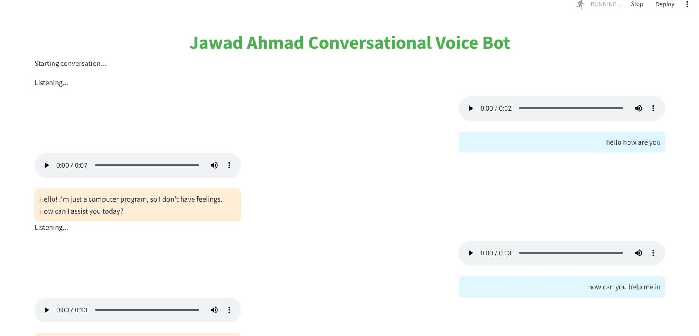
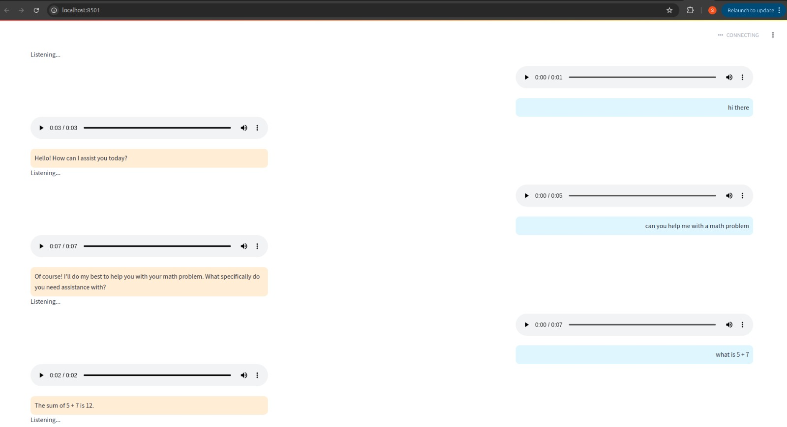

# Conversational Voice Bot

A *Conversational Voice Bot* built with *Streamlit* that allows real-time voice interaction using OpenAI's GPT model and Google Text-to-Speech (gTTS). This bot lets users speak to it, processes their input using *speech recognition*, generates GPT responses, and provides an audio response.

## Features

- **Real-time Voice Interaction**: Speak to the bot, and it will respond in both text and audio formats.
- **GPT-3.5 Powered Responses**: Utilizes OpenAI's GPT model to generate intelligent, conversational responses.
- **Text-to-Speech (TTS)**: Converts the bot's responses into audio using Google TTS.
- **User-Friendly UI**: Built using Streamlit with a clean and intuitive interface.

## Screenshot 1



## Screenshot 2


## Prerequisites

Before running the application, ensure you have the following installed:

- Python 3.10
- Required libraries: `streamlit`, `openai`, `speechrecognition`, `gtts`, and `asyncio`.

## Setup Instructions

1. *Clone the Repository*

   ```bash
   git clone https://github.com/jawadahmad016/real-time-voice-bot.git
   cd real-time-voice-bot


2. *Install Dependencies*

Create a virtual environment (optional but recommended):

```bash
python -m venv venv
source venv/bin/activate  # On Windows: venv\Scripts\activate
```
Install the required Python packages:

```bash
pip install -r requirements.txt
```

3. *Set Your OpenAI API Key*

Replace the placeholder API key in the openai.api_key line with your actual OpenAI API key in app.py file.
```python
openai.api_key = 'sk-<your-api-key>'
```

4. *Run the Application*

Launch the Streamlit app:
```bash
streamlit run app.py
```
5. *Interact with the Bot*

Open the app in your browser (usually at http://localhost:8501), speak to the bot, and enjoy the conversation!

## Directory Structure

```
project-root/
│
├── app.py               # Main Streamlit app
├── requirements.txt     # Python dependencies
├── Images               # Screenshot of the app
└── README.md            # Project documentation
```


## License
This project is licensed under the MIT License. Feel free to use and modify it for your purposes.

## Contribution
Author: Jawad Ahmad  
Contact: jawadahm016@gmail.com